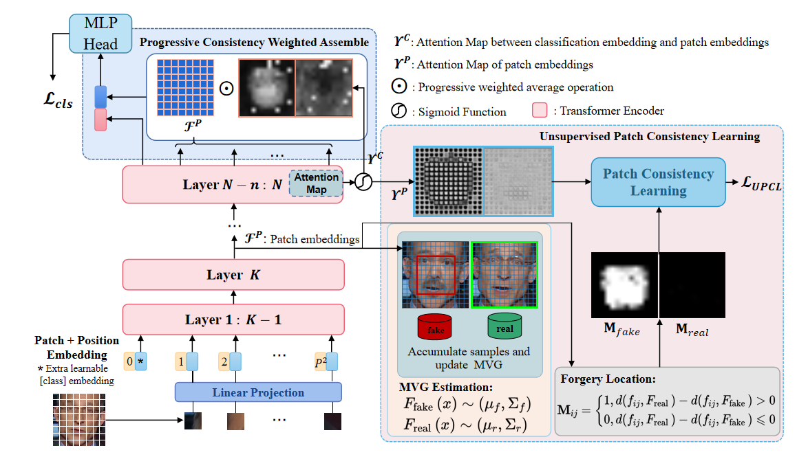

## Introduction

This is our new work about Face Forgery Detection, which has been accepted by ECCV 2022 (oral). 

**UIA-ViT: Unsupervised Inconsistency-Aware Method based on Vision Transformer for Face Forgery Detection**



paper link: https://arxiv.org/abs/2210.12752

## Environment

pytorch==1.6.0
torchvision==0.5.0
cudatoolkit==10.1
timm==0.4.12

## Test

Test code: ``test.py``

## Train

Train code: ``train.py``

Our trained model has been released: https://drive.google.com/drive/folders/1zPx4TLEfLnJDZYpSV0LhFvrMEEDzroB0?usp=sharing

Some main code about our proposed UPCL is in ``utils/utils.py``.

## Citations
Please cite the following paper in your publications if you use the python implementations:

```
@inproceedings{zhuang2020UIA,
  title={UIA-ViT: Unsupervised Inconsistency-Aware Method based on Vision Transformer for Face Forgery Detection},
  author={Zhuang, Wanyi and Chu, Qi and Tan, Zhentao and Liu, Qiankun and Yuan, Haojie and Miao, Changtao and Luo, Zixiang and Yu, Nenghai},
  booktitle={European Conference on Computer Vision (ECCV)},
  year={2022},
}
```
